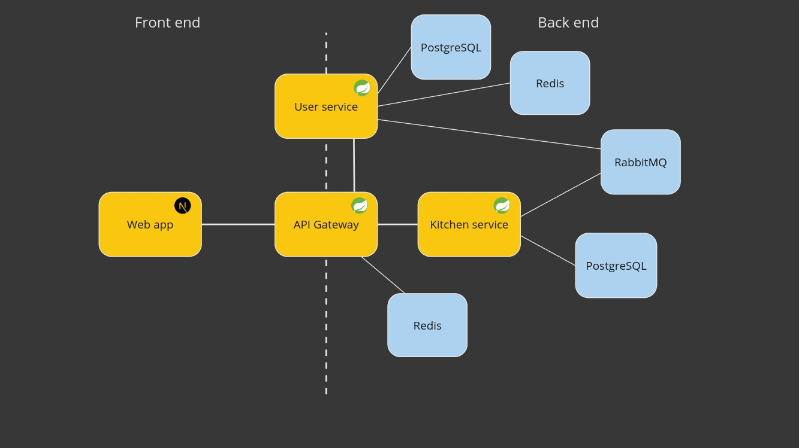
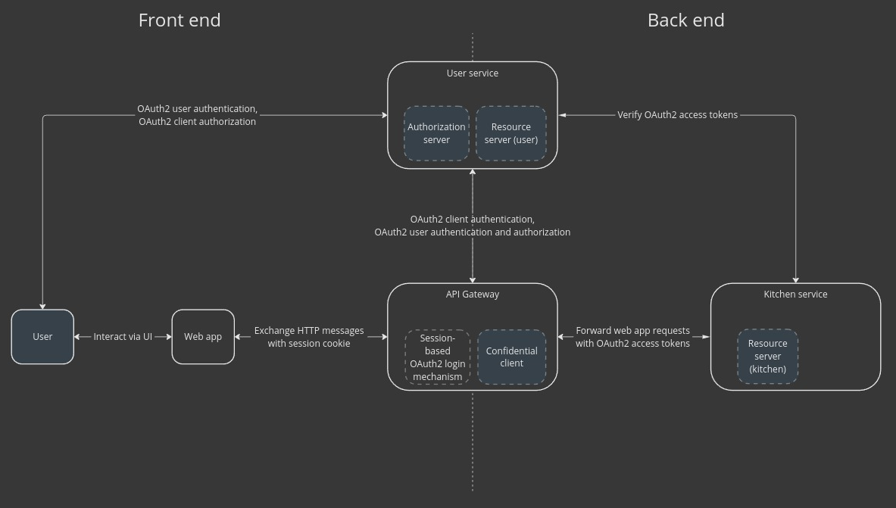

# Cook it yourself

Simple app to put some software development skills into practice.

# Overview

## Functionality

From functional point of view, the purpose was to create application that would help in all cooking activities like choosing what to cook for dinner today, check off ingredients required to cook given dish during shopping and so on. 
However, for now, to keep things simple, all you can do is simply manage your recipes.

## Technical details

From technical point of view, the goal was to create application based on microservice architecture with different dependencies as database, asynchronous and synchronous messaging service, cache, distributed authentication and authorization and so on, so that it would show how the real application based on microservice architecture could look like.

The app is separated into front-end web application and back-end services, as depicted on the image below.



- Web app implemented with Javascript, Typescript, React, Next.js and Bootstrap.
- Backend services implemented with Java, DDD, Spring Boot, Spring Security, Spring Cloud, PostgresSQL, Redis and RabbitMQ.
- Every app is containerized via Docker, so it can be started and tested independently on local environment without any manual setup. Besides that, they all can work together in Kubernetes by applying prepared config files.
- The apps have automated CI processes configured with GitHub Actions, so that a new version of each app is automatically built, tested and containerized.
- Web app and services communicate with each other synchronously via REST API or asynchronously via AMQP API.
- Back-end services are secured by OAuth 2 protocol.

# Applications

## Web app


- web application based on Next.js with Client & Server Rendering 
- communicates with back-end through REST API via API Gateway

## API Gateway


- secures access to back-end services via OAuth 2 (Confidential client)
- forwards incoming requests to proper services, returns their responses back to the client

## User service


- enables signing up, authentication and authorization
- acts as Authorization server in OAuth 2 dance

## Kitchen service


- service where cook (aka user) can manage its recipes
- acts as Resource server in OAuth 2 dance

# Security

Services are secured via OAuth 2 protocol.



# Run locally on Kubernetes

As mentioned, you can run the apps locally on Kubernetes, by going through the following steps:

1. Configure your local environment to map _auth.ciy.localhost_ and _ciy.localhost_ hostnames to _127.0.0.1_ address. This is required to avoid cookies conflict in your browser. The easiest way to accomplish that is by modifying hosts file and adding the following entries into it:
    ```
    127.0.0.1   auth.ciy.localhost
    127.0.0.1   ciy.localhost
    ```
    [How to Edit Hosts File in Windows, macOS, and Linux](https://www.liquidweb.com/blog/edit-hosts-file-macos-windows-linux/)

2. Create a local Kubernetes cluster. I personally use [kind](https://kind.sigs.k8s.io/) but anything should be working.
3. Install and deploy NGINX Gateway Fabric. It's implementation of [Gateway API](https://kubernetes.io/docs/concepts/services-networking/gateway/) that would make services available for external connections. [Click here to go to the installation guide](https://docs.nginx.com/nginx-gateway-fabric/installation/installing-ngf/manifests/).
4. Deploy apps and its dependencies. There is a main k8s config directory and every app has its own config directory as well. Start from applying the root config and after that go through config of each app in the following order: user-service, kitchen-service, api-gateway, web-app.
    ```
    kubectl apply -f ./k8s
    kubectl apply -f ./user-service/k8s
    kubectl apply -f ./kitchen-service/k8s
    kubectl apply -f ./api-gateway/k8s
    kubectl apply -f ./web-app/k8s
    ``` 
    Confirm that the apps are deployed correctly by checking pods status.
    ```
   kubectl get pods
   
   > NAME                                        READY   STATUS    RESTARTS      AGE
   > api-gateway-7697dbdb4-s5zqp                 1/1     Running   0             82s
   > kitchen-service-686966bdd9-wdcm7            1/1     Running   1 (69s ago)   91s
   > kitchen-service-postgres-6546844979-pn92x   1/1     Running   0             91s
   > rabbitmq-75c4b46bff-6lr54                   1/1     Running   0             2m9s
   > user-service-6f545c4946-r9rww               1/1     Running   2 (53s ago)   98s
   > user-service-postgres-67c7df67b8-cv6f9      1/1     Running   0             98s
   > user-service-redis-6c64b4ffdf-n756l         1/1     Running   0             98s
   > web-app-86bf4b6cdd-wkm8r                    1/1     Running   0             76s
    ```
5. Open port forwarding between local environment and an nginx pod as explained [here](https://docs.nginx.com/nginx-gateway-fabric/installation/running-on-kind/). To make it easy to switch between deployed and developed web-app application open local ports _3000_ and _8080_ to pod's port _80_.
    ```
    kubectl -n nginx-gateway get pods
   
    > NAME                             READY   STATUS    RESTARTS   AGE
    > nginx-gateway-5d49f68457-zc9vg   2/2     Running   0          9m39s
   
    kubectl -n nginx-gateway port-forward pod/nginx-gateway-5d49f68457-zc9vg 3000:80 8080:80
    ```
6. Open the browser and go to ciy.localhost:3000 site.


