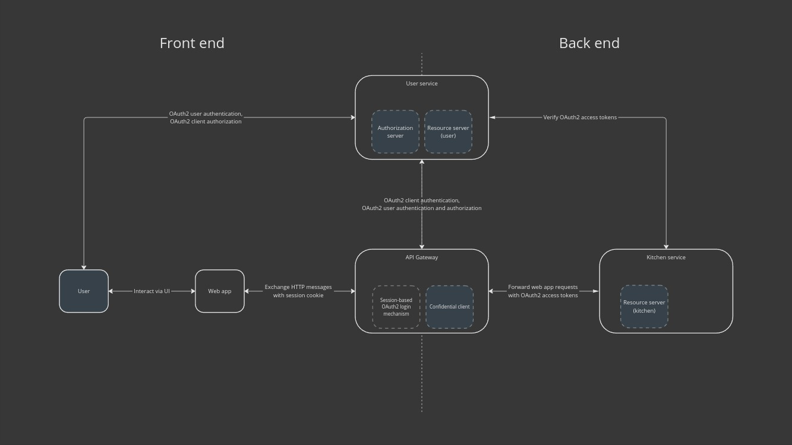

# Cook it yourself
Simple app to put some Java & Javascript programming skills into practice.

# Overview

The goal was to create application based on microservice architecture.

The app is separated into front-end web application and back-end services, as depicted on the image below.

- Every app is containerized via Docker, so it can be simply started independently.
- Back-end services and their dependencies are configured to work out-of-the box on local Kubernetes cluster so running all services correctly is as easy as never.

## Web app

- web application based on Next.js with Client & Server Rendering 
- communicates with back-end through REST API via API Gateway

## API Gateway

- secures access to back-end services via OAuth 2 (Confidential client)
- forwards incoming requests to proper services, returns their responses back to the client

## User service

- enables signing up, authentication and authorization
- acts as Authorization server in OAuth 2 dance

# Kitchen service

- service where cook (aka user) can manage its recipes
- acts as Resource server in OAuth 2 dance

Each app has its own README file containing more details about itself.

# Security

Services are secured thanks to OAuth 2 protocol.

